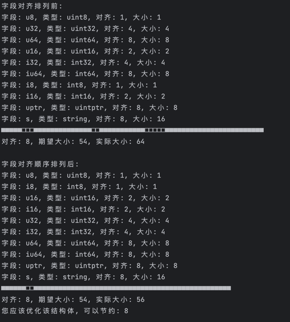

# GoOptimizer

golang优化工具。对结构体进行内存对齐。

[optimizer](https://github.com/lizongying/go-optimizer)

[english](./README.md)

## 功能

* 对结构体进行内存对齐。

## 安装

```shell
go get -u github.com/lizongying/gooptimizer
```

## 用法

简单使用：

```go
package main

import (
	"github.com/lizongying/gooptimizer"
)

type T1 struct {
	u8   uint8
	u32  uint32
	u64  uint64
	u16  uint16
	i32  int32
	iu64 int64
	i8   int8
	i16  int16
	uptr uintptr
	s    string
}

func main() {
	gooptimizer.StructAlignment(new(T1))
}
```

结果:

重新排列字段顺序后，结构体的大小由64字节减少到56字节




