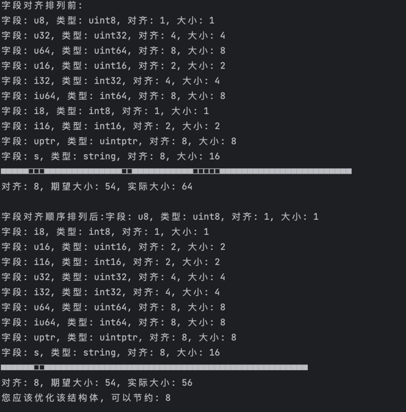

# GoOptimizer

golang优化工具。对结构体进行内存对齐。

[gooptimizer](https://github.com/lizongying/gooptimizer)

[english](./README.md)

## 功能

* 对结构体进行内存对齐。

## 安装

```shell
go get -u github.com/lizongying/gooptimizer
```

## 用法

注意: 为了方便，本工具只处理小于256字节的结构体

建议对所有结构体都进行测试

简单使用：

```go
package main

import (
	"fmt"
	"github.com/lizongying/gooptimizer"
)

type T1 struct {
	u8   uint8
	u32  uint32
	u64  uint64
	u16  uint16
	i32  int32
	iu64 int64
	i8   int8
	i16  int16
	uptr uintptr
	s    string
}

func main() {
	should := gooptimizer.StructAlign(new(gooptimizer.Alignment))
	fmt.Println(should)

	// print
	//gooptimizer.StructAlignWithPrint(new(gooptimizer.Alignment))

	// cn print
	//gooptimizer.StructAlignWithCNPrint(new(T1))
}
```

```go
package main

import (
	"github.com/lizongying/gooptimizer"
	"testing"
)

func TestMain_T1(t *testing.T) {
	result := gooptimizer.StructAlign(new(T1))
	if !result {
		t.Error("Expected true, but got false")
	}
}

func TestMain_Alignment(t *testing.T) {
	result := gooptimizer.StructAlign(new(gooptimizer.Alignment))
	if !result {
		t.Error("Expected true, but got false")
	}
}
```

结果:

重新排列字段顺序后，结构体的大小由64字节减少到56字节




